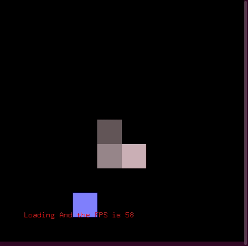

# aGameOfSnake

## Note

I made this long before I understood good programming practices. I really enjoyed making it, however, it is filled with global variables, bugs and spelling mistake in variable names.

## What is it?

A program that lets you play snake, and if you want, it will play the game for you the best it can.


This is what it looks like.




It often does rather badly.


You can change the snake colour with `e` on the keyboard.


It's also cool to see it play on a large canvas.

## How to run

```
sudo apt-get install freeglut3-dev
pip install PyOpenGL PyOpenGL_accelerate
git clone https://github.com/ethanboxx/aGameOfSnake.git
cd aGameOfSnake/
python2 index.py
```
